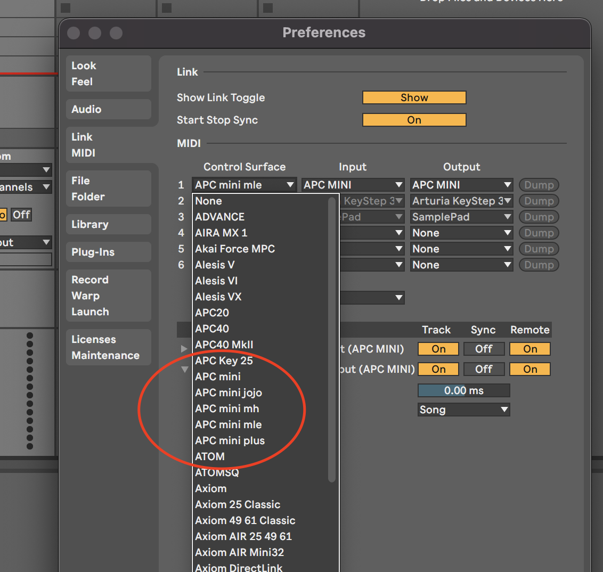

# APC_mini X

Some Awesome Midi Remote scripts for controlling Ableton Live using an APC mini

## Installation (Ableton Live 11)

* Shut down Live
* Edit `install.sh` file and make sure that your `ABLETON_HOME` is correct
* Launch `./install.sh` will copy scripts into your Ableton Live scripts directory
* Restart Live
* In the Live->Preferences menu choose the control surface you want as follows: 

## Demo

| Scripts | Control | In brief | Demo | Thanks to |
| ------ | ------ | ------ | ------ | ------ |
| [jojo](./jojo/README.md) | APC Mini JOJO | ? | none | [JOJ0](https://github.com/JOJ0/ableton-live9-remote-scripts/tree/master/APC_mini_jojo)|
| [mh](./mh/README.md) | APC Mini MH | Live looping (bar, metronome, remove, undo...) | [youtube](https://www.youtube.com/watch?v=Nd9lvAHpqTE&feature=youtu.be) | [markharwood](https://github.com/markharwood/MH_APC_mini) |
| [plus](./plus/README.md) | APC Mini PLUS | Live looping (bar, metronome, remove, undo...) | [youtube](https://youtu.be/Rrd3BDDvSlc) | [PaulBriere](https://gitlab.com/Paulybri/apc_mini_plus) |
| [mle](./mle/README.md) | APC Mini MLE | Opinion oriented bar Live looping | None | @mat_cloud |

